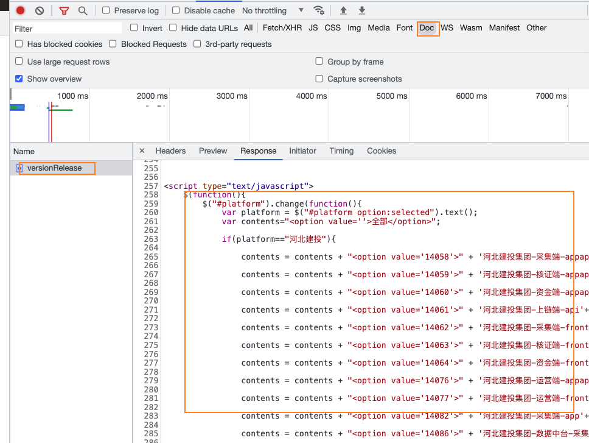

# node 自动化版本发布脚本

> 程序启动后 让它自己跑就行 不用管它, 你可以做其他的事情. 直到程序执行完毕

## docs

**如果不想看到浏览器界面或静默发布 在/src/build.js**

``` js
    const browser = await puppeteer.launch({
        headless: false,
    });
    // 改为
    const browser = await puppeteer.launch();
```
---
**当ecp租户更新时, 我们需要对FK Map做出对应的更新, 无需手动录入**

>将上方截图全中内所有script代码复制到 /src/system/sampleCode.js内

运行

`
npm run update
`

---
